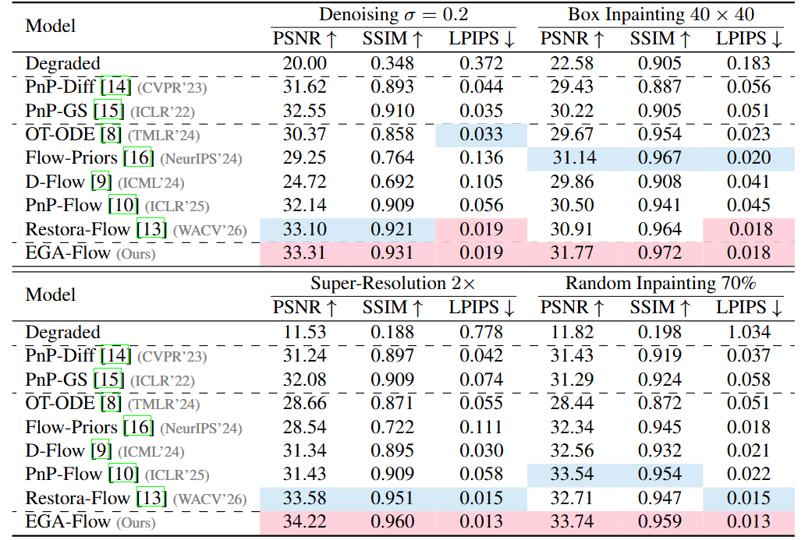
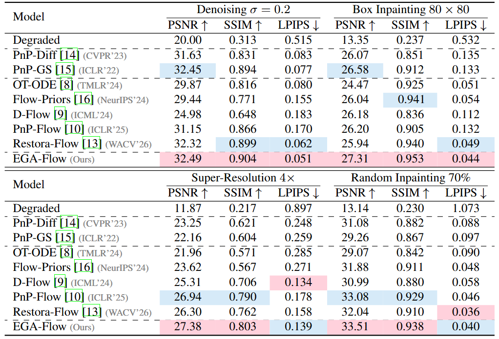

<h1 align="center">
  EGA-Flow: Stable Image Restoration with Flow Matching via Endpoint Gradient Alignment
</h1>

<p align="center">
  Jiaqi Zhang<sup>1</sup><br>
  <sup>1</sup>School of Computer Science and Telecommunication Engineering, Jiangsu University, China
</p>

<p align="center">
  
  
  
</p>

---


## 📌 Abstract

Flow Matching (FM) provides an efficient generative prior for image restoration by learning a continuous velocity field that transports a noise distribution to the data distribution. However, existing flow-based restoration methods typically lack modeling of the reliability of measurement gradient directions, which can lead to misalignment between measurement guidance and the generative trajectory, producing overly smooth or unstable results under complex degradations. To address this, we propose EGA-Flow, a flow-matching image restoration method based on endpoint gradient alignment. EGA-Flow remaps measurement guidance from the clean endpoint space and selects reliable gradients using both endpoint transport direction and temporal consistency, allowing measurement constraints to be integrated more stably into the Flow Matching sampling trajectory. Extensive experiments show that EGA-Flow achieves more stable performance than current state-of-the-art (SOTA) methods, demonstrating the effectiveness of endpoint gradient alignment in mitigating over-smoothing and trajectory misalignment.

---


## 💡 Key Features

+ We propose the Endpoint Measurement Gradient, which transfers guidance to the clean-endpoint space and allows data consistency to directly constrain the restoration target.
+ We propose Endpoint Gradient Alignment, which evaluates gradient reliability through flow-direction and temporal consistency, and stabilizes the sampling path via reprojection.
+ Experiments on various image restoration tasks show that EGA-Flow effectively improves reconstruction accuracy while stabilizing the consistency between observation guidance and generative trajectories.

---


## 🎇 Quantitative and Qualitative Analysis

<p align="center">
  
</p>

<p align="center">
  
</p>

<p align="center">
  
</p>

<p align="center">
  
</p>

---


## 🛠 Installation & Usage

The following instructions define the standard setup, data preparation, and evaluation protocol used for EGA-Flow experiments on CelebA and AFHQ-Cat.

### 1. Environment Setup

```bash
# Clone the repository
git clone <repo-url>
cd EGA-Flow

# Create and activate the conda environment
conda create -n EGA-Flow python=3.10 -y
conda activate EGA-Flow

# Install PyTorch according to your CUDA version
pip install torch torchvision torchaudio --index-url https://download.pytorch.org/whl/cu121

# Install the remaining dependencies
pip install -r Requirements.txt
```

### 2. Supported Data and Tasks

| Dataset | Image size | Supported tasks |
|---|---:|---|
| CelebA | 128x128 | `denoising`, `box_inpainting`, `random_inpainting`, `superresolution` |
| AFHQ-Cat | 256x256 | `denoising`, `box_inpainting`, `random_inpainting`, `superresolution` |

### 3. Dataset and Checkpoint Preparation

Please refer to [annegnx/PnP-Flow](https://github.com/annegnx/PnP-Flow) and [imigraz/Restora-Flow](https://github.com/imigraz/Restora-Flow) for dataset and checkpoint preparation.

### 4. Running Experiments

Run all standard non-deblurring EGA-Flow tasks on CelebA and AFHQ-Cat:

```bash
bash Script_Test.sh
```

A single task can be launched with the same command-line format:

```bash
python Main.py --opts data_root ./Data dataset celeba eval_split test model ot problem denoising method EGA-Flow max_batch 25 batch_size_ip 4 compute_metrics True dim_image 128 sf 2 mask_size_x 40 mask_size_y 40 p_value 0.7 sigma_y 0.01 denoise_sigma 0.2
```

Supported command options:

| Option | Supported values |
|---|---|
| `model_type` / `model` | `ot` |
| `dataset` | `celeba`, `afhq_cat` |
| `problem` | `denoising`, `box_inpainting`, `random_inpainting`, `superresolution` |
| `method` | `EGA-Flow` |
| Baselines included in code | `Restora-Flow`, `PnP-Flow`, `PnP-GS`, `Flow-Priors`, `D-Flow`, `OT-ODE`, `Degraded` |

Results are saved to:

```text
Results/{dataset}/{model_type}/{problem}/{degradation}/EGA-Flow/test/{timestamp}/
```

### 5. Standard Evaluation Settings

| Dataset | Task | Image size | Degradation | Gaussian noise |
|---|---|---:|---|---|
| CelebA | denoising | 128x128 | identity operator | `denoise_sigma=0.2` |
| CelebA | box_inpainting | 128x128 | center box mask `40x40` | `sigma_y=0.01` |
| CelebA | random_inpainting | 128x128 | random missing `p_value=0.7`, keep 30% | `sigma_y=0.01` |
| CelebA | superresolution | 128x128 | scale factor `sf=2`, 128 -> 64 -> 128 | `sigma_y=0.01` |
| AFHQ-Cat | denoising | 256x256 | identity operator | `denoise_sigma=0.2` |
| AFHQ-Cat | box_inpainting | 256x256 | center box mask `80x80` | `sigma_y=0.01` |
| AFHQ-Cat | random_inpainting | 256x256 | random missing `p_value=0.7`, keep 30% | `sigma_y=0.01` |
| AFHQ-Cat | superresolution | 256x256 | scale factor `sf=4`, 256 -> 64 -> 256 | `sigma_y=0.01` |

---


## 📏 Metrics

Each run writes PSNR, SSIM, LPIPS, and runtime to `eval.txt` under the corresponding result directory.

